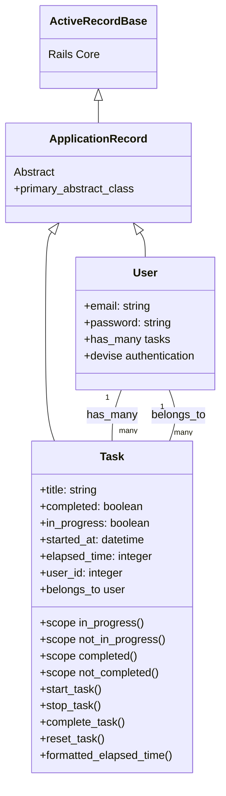

# donezoアプリケーションのモデル層クラス図

## モデル層の説明

- **ActiveRecordBase**: Railsのコアクラスで、データベースとのマッピングを提供
- **ApplicationRecord**: ActiveRecordBaseを継承した抽象クラスで、アプリケーション固有の共通機能を提供
- **User**: ユーザーモデル、Deviseによる認証機能を持ち、複数のタスクを所有
- **Task**: タスクモデル、ユーザーに所属し、状態管理（実行中、完了など）と時間計測機能を持つ

### 主要なメソッド

**Task**:
- `start_task()`: タスクを実行中にする（他の実行中タスクは停止）
- `stop_task()`: タスクを停止し、経過時間を更新
- `complete_task()`: タスクを完了状態にする
- `reset_task()`: タスクをリセットする
- `formatted_elapsed_time()`: 経過時間を人間が読める形式で返す
