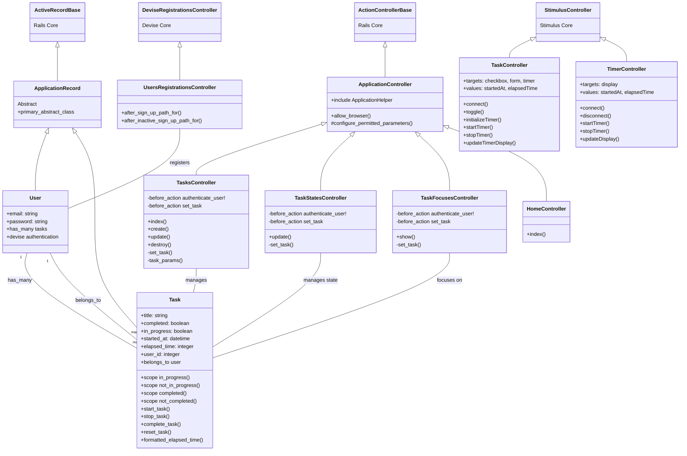

# donezoアプリケーションのクラス図

## クラス図の説明

### モデル層
- `ApplicationRecord`: ActiveRecordの基底クラス
- `User`: ユーザーモデル、Deviseによる認証機能を持ち、複数のタスクを所有
- `Task`: タスクモデル、ユーザーに所属し、状態管理と時間計測機能を持つ

### コントローラー層
- `ApplicationController`: コントローラーの基底クラス
- `TasksController`: タスクのCRUD操作を担当
- `TaskStatesController`: タスクの状態（実行中、停止、完了）を管理
- `TaskFocusesController`: 特定のタスクにフォーカスする機能を提供
- `HomeController`: ホームページを表示
- `Users::RegistrationsController`: ユーザー登録をカスタマイズ

### JavaScript層
- `TaskController`: タスクの状態管理とタイマー機能を実装するStimulusコントローラー
- `TimerController`: タイマー機能を実装するStimulusコントローラー
