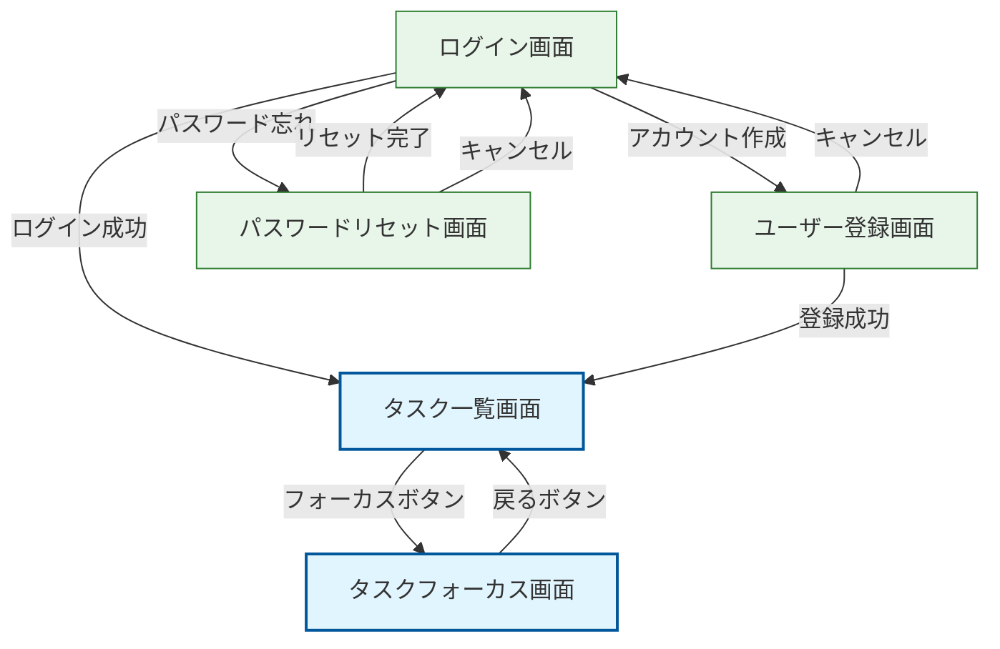

# Donezo 画面遷移図

このドキュメントでは、Donezoアプリケーションの画面遷移と主要な画面について説明します。

## 画面遷移図

以下は、Donezoアプリケーションの主要な画面遷移を示す図です。

## 主要画面の説明

### 1. ログイン画面

ユーザーがアプリケーションにアクセスする際の入口となる画面です。

**主要要素:**
- メールアドレス入力フィールド
- パスワード入力フィールド
- ログインボタン
- アカウント作成リンク
- パスワードリセットリンク

**遷移先:**
- ログイン成功時: タスク一覧画面
- アカウント作成リンク: ユーザー登録画面
- パスワードリセットリンク: パスワードリセット画面

### 2. ユーザー登録画面

新規ユーザーがアカウントを作成するための画面です。

**主要要素:**
- メールアドレス入力フィールド
- パスワード入力フィールド
- パスワード確認入力フィールド
- 登録ボタン
- キャンセルリンク

**遷移先:**
- 登録成功時: タスク一覧画面
- キャンセル時: ログイン画面

### 3. タスク一覧画面

ユーザーのタスクを一覧表示し、タスク管理の中心となる画面です。

**主要要素:**
- ヘッダー（タスク統計情報）
- タスク追加フォーム
- タスク一覧
  - 各タスク項目
    - 完了チェックボックス
    - タスクタイトル
    - タスク作成日時
    - 経過時間（該当する場合）
    - 操作ボタン（開始/停止/フォーカス/削除）
- ヒント表示

**アクション:**
- タスク追加: フォームに入力して追加
- タスク完了/未完了: チェックボックスをクリック
- タスク開始: 開始ボタンをクリック
- タスク停止: 停止ボタンをクリック
- タスク削除: 削除ボタンをクリック
- タスクフォーカス: フォーカスボタンをクリック

**遷移先:**
- フォーカスボタン: タスクフォーカス画面

### 4. タスクフォーカス画面

特定のタスクに集中するための画面です。大きなタイマー表示と操作ボタンが特徴です。

**主要要素:**
- 戻るリンク
- 大きなタイマー表示
- タスクタイトル
- タスク作成日時
- 操作ボタン（開始/停止/完了/削除）
- 次のタスク表示（ある場合）

**アクション:**
- タスク開始/停止: 対応するボタンをクリック
- タスク完了: 完了ボタンをクリック
- タスク削除: 削除ボタンをクリック
- 一覧に戻る: 戻るリンクをクリック

**遷移先:**
- 戻るリンク: タスク一覧画面

## 画面遷移の特徴

Donezoアプリケーションは、Hotwire（TurboとStimulus）を活用することで、多くのアクションがページ遷移なしで実行されます。これにより、スムーズなユーザー体験を実現しています。

**ページ遷移が発生するケース:**
- ログイン/ログアウト
- ユーザー登録
- タスクフォーカス画面の表示/終了

**ページ遷移なしで実行されるアクション:**
- タスクの追加
- タスクの完了/未完了切り替え
- タスクの開始/停止
- タスクの削除

この設計により、ユーザーはスムーズかつ効率的にタスク管理を行うことができます。
