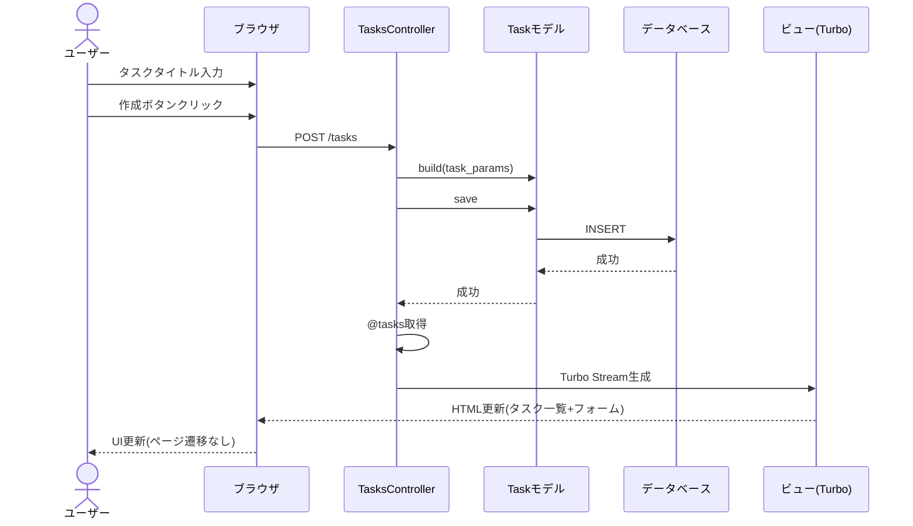
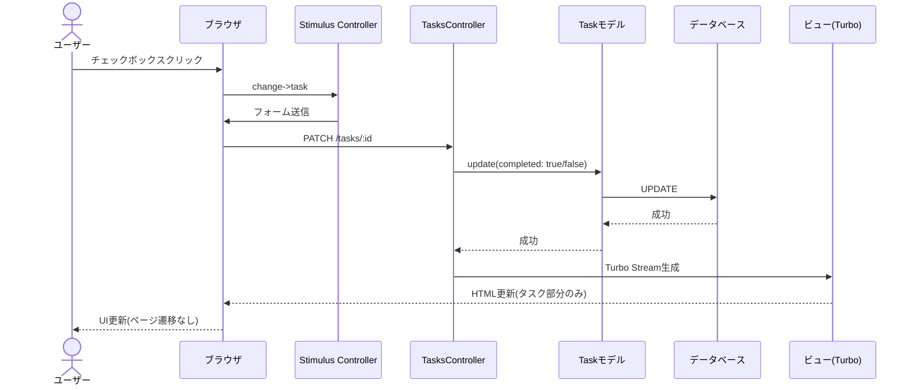
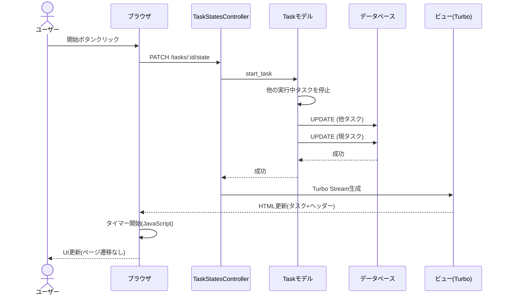
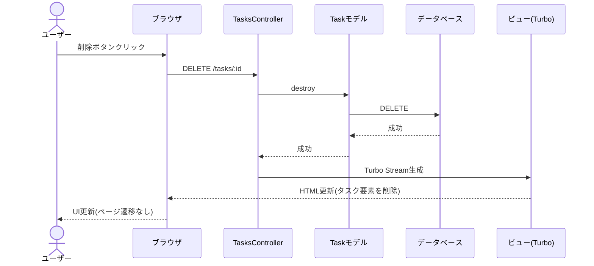
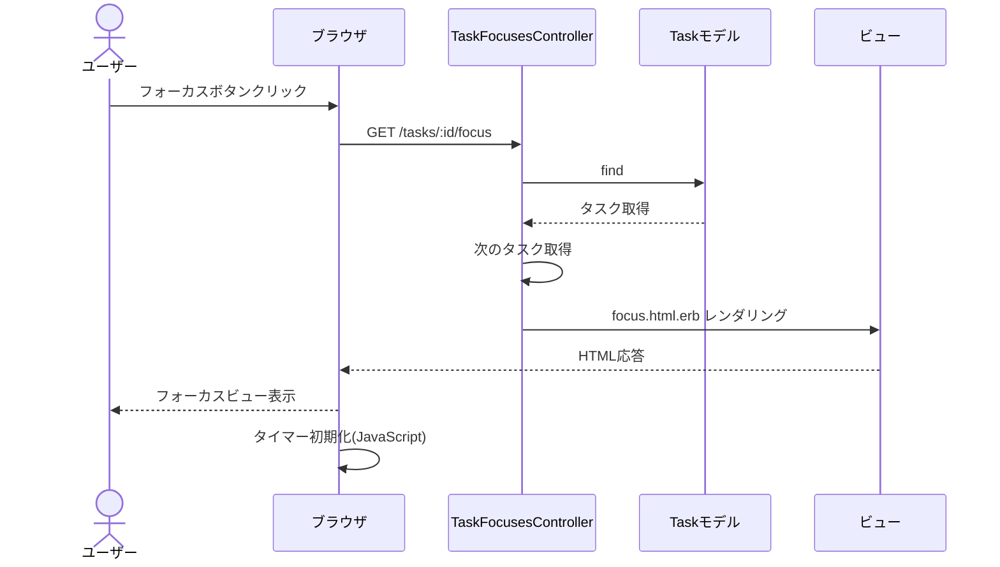

# Donezo シーケンス図

このドキュメントでは、Donezoアプリケーションの主要な処理フローをシーケンス図で説明します。

## 1. タスク作成フロー

以下は、ユーザーが新しいタスクを作成する際の処理フローです。

## 2. タスク完了状態切替フロー

以下は、ユーザーがタスクの完了状態を切り替える際の処理フローです。

## 3. タスク実行開始フロー

以下は、ユーザーがタスクを実行開始する際の処理フローです。

## 4. タスク削除フロー

以下は、ユーザーがタスクを削除する際の処理フローです。

## 5. タスクフォーカスフロー

以下は、ユーザーがタスクフォーカスビューを表示する際の処理フローです。

これらのシーケンス図は、Donezoアプリケーションの主要な処理フローを示しています。Hotwire（TurboとStimulus）を活用することで、ページ遷移なしでのインタラクティブなユーザー体験を実現しています。
