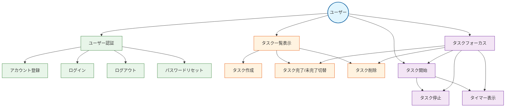

# Donezo ユースケース図

以下は、Donezoアプリケーションの主要なユースケースを示す図です。

## 主要ユースケース説明

### ユーザー管理

1. **アカウント登録**
   - ユーザーはメールアドレスとパスワードでアカウントを作成できる
   - 登録後、自動的にログイン状態になる

2. **ログイン**
   - 登録済みユーザーはメールアドレスとパスワードでログインできる
   - ログイン状態はセッションで維持される

3. **ログアウト**
   - ログイン中のユーザーはログアウトできる
   - ログアウト後は認証が必要な機能にアクセスできなくなる

4. **パスワードリセット**
   - パスワードを忘れたユーザーはリセットメールを受け取り、新しいパスワードを設定できる

### タスク管理

1. **タスク一覧表示**
   - ユーザーは自分のタスク一覧を閲覧できる
   - タスクは作成日時の降順で表示される
   - タスクの状態（完了/未完了、実行中/停止中）が視覚的に区別される

2. **タスク作成**
   - ユーザーはタイトルを入力して新規タスクを作成できる
   - 作成されたタスクは即座に一覧に追加される（ページ遷移なし）

3. **タスク完了/未完了切替**
   - ユーザーはチェックボックスをクリックしてタスクの完了状態を切り替えられる
   - 完了したタスクは視覚的に区別される（取り消し線、色変更）

4. **タスク削除**
   - ユーザーは不要なタスクを削除できる
   - 削除されたタスクは即座に一覧から除外される

### タスク実行管理

1. **タスク開始**
   - ユーザーはタスクを「実行中」状態に設定できる
   - 一度に1つのタスクのみ実行中にできる（他の実行中タスクは自動的に停止）
   - 実行中タスクの経過時間がリアルタイムで表示される

2. **タスク停止**
   - ユーザーは実行中のタスクを停止できる
   - 停止時の経過時間が保存される

3. **タスクフォーカス**
   - ユーザーは特定のタスクに集中するためのフォーカスビューを表示できる
   - フォーカスビューでは大きなタイマー表示と操作ボタンが表示される
   - 次のタスクも表示される（ある場合）
